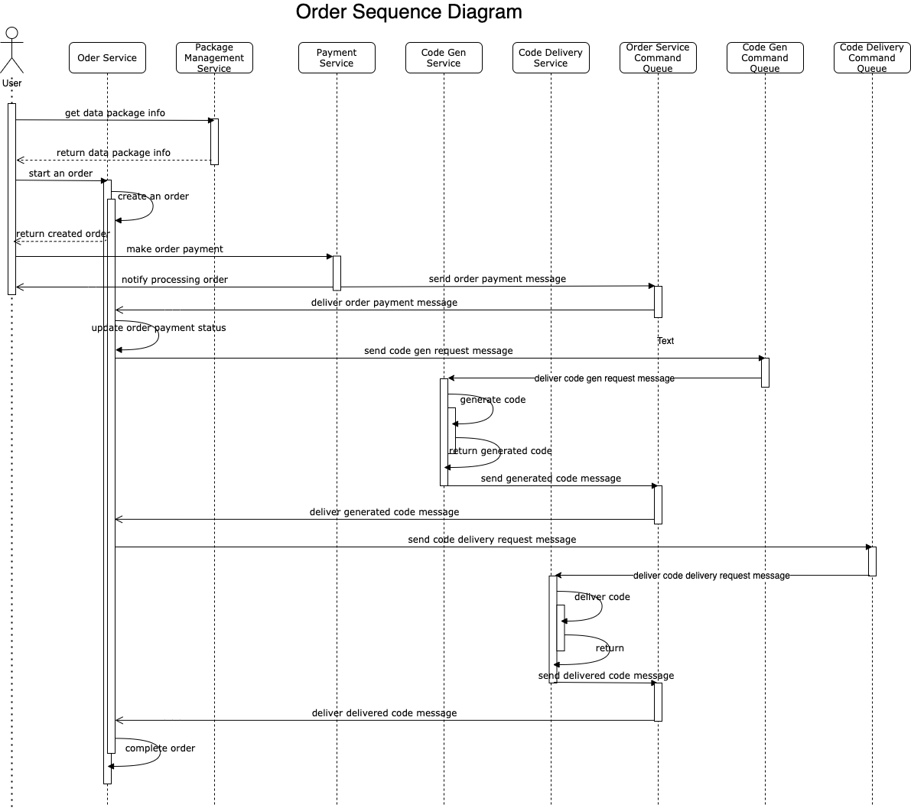

##

Here are steps to make a full processing flow of a data package order, please check server reponse and server log to
verify result of each step

1. Create a data package
   ```sh
   curl -X POST "http://localhost:8080/api/v1/data-packages" -H "accept: */*" -H "Content-Type: application/json" -d "{\"packageDesc\":\"Package 1 Description\",\"packageDuration\":10,\"packageName\":\"Package 1\",\"packagePrice\":45.99}"
   ```
   You will get a response like:
   ```
   {"id":1,"packageName":"Package 1","packageDesc":"Package 1 Description","packagePrice":45.99,"packageDuration":10}
   ```
   Application server log:
   ```
   2021-05-12 07:40:06.757  INFO 33484 --- [nio-8080-exec-1] c.n.v.a.s.c.DataPackageController        : Received request to create a new data package
   Hibernate: insert into data_package (id, created_at, package_description, package_duration, package_name, package_price, updated_at) values (default, ?, ?, ?, ?, ?, ?)
   Hibernate: values identity_val_local()
   2021-05-12 07:40:06.813  INFO 33484 --- [nio-8080-exec-1] c.n.v.a.s.service.DataPackageService     : Created data package with id: 1
   ```
2. Creat an order for data package created step 1
   ```sh
   curl -X POST "http://localhost:8080/api/v1/orders" -H "accept: */*" -H "Content-Type: application/json" -d "{\"dataPackageId\":0,\"phoneNumber\":\"0912345678\"}"  
   ```

   You will get a response like:
   ```
   {"id":1,"dataPackageId":0,"phoneNumber":"0912345678","orderStatus":"OPEN"}
   ```

   Application server log:
   ```
   2021-05-12 07:40:14.577  INFO 33484 --- [nio-8080-exec-2] c.n.v.a.o.controller.OrderController     : Received request to create a new order
   Hibernate: insert into package_order (id, created_at, data_package_id, order_status, phone_number, updated_at) values (default, ?, ?, ?, ?, ?)
   Hibernate: values identity_val_local()
   2021-05-12 07:40:14.586  INFO 33484 --- [nio-8080-exec-2] c.n.v.a.order.service.OrderService       : Created order with id: 1
   ```
3. Make payment for order crated in step 2
   ```sh
   curl -X POST "http://localhost:8080/api/v1/payments" -H "accept: */*" -H "Content-Type: application/json" -d "{\"orderId\":1,\"paymentAmount\":45.99,\"paymentStatus\":\"PAID\"}"  
   ```   
   You will get a response like:
   ```
   {"id":1,"orderId":1,"paymentAmount":45.99,"paymentStatus":"PAID"}
   ```
   Then application processes order as flow described below
   <p align="center">
       
   </p>

   Application server log:
   ```
   2021-05-12 07:40:21.088  INFO 33484 --- [nio-8080-exec-4] c.n.v.a.p.controller.PaymentController   : Received request to create a new payment
   Hibernate: insert into payment (id, created_at, order_id, payment_amount, payment_status, updated_at) values (default, ?, ?, ?, ?, ?)
   Hibernate: values identity_val_local()
   2021-05-12 07:40:21.104  INFO 33484 --- [nio-8080-exec-4] c.n.v.a.payment.service.PaymentService   : Created payment for order with id: 1
   2021-05-12 07:40:21.112  INFO 33484 --- [nio-8080-exec-4] c.n.v.a.payment.service.PaymentService   : PAYMENT SERVICE - Sent a message to notify order service about payment for order with id: 1
   2021-05-12 07:40:21.117  INFO 33484 --- [enerContainer-1] c.n.v.a.o.service.OrderChannelHandler    : ORDER SERVICE - Received payment information for order with id: 1
   Hibernate: select order0_.id as id1_2_0_, order0_.created_at as created_2_2_0_, order0_.data_package_id as data_pac3_2_0_, order0_.order_status as order_st4_2_0_, order0_.phone_number as phone_nu5_2_0_, order0_.updated_at as updated_6_2_0_ from package_order order0_ where order0_.id=?
   2021-05-12 07:40:21.141  INFO 33484 --- [enerContainer-1] c.n.v.a.o.service.OrderChannelHandler    : ORDER SERVICE - Updated order status as PAID for order with id: 1
   Hibernate: select order0_.id as id1_2_0_, order0_.created_at as created_2_2_0_, order0_.data_package_id as data_pac3_2_0_, order0_.order_status as order_st4_2_0_, order0_.phone_number as phone_nu5_2_0_, order0_.updated_at as updated_6_2_0_ from package_order order0_ where order0_.id=?
   2021-05-12 07:40:21.145  INFO 33484 --- [enerContainer-1] c.n.v.a.o.service.OrderChannelHandler    : ORDER SERVICE - Sent request to generate code for order with id: 1
   2021-05-12 07:40:21.149  INFO 33484 --- [enerContainer-1] c.n.v.a.c.service.CodeGenChannelHandler  : CODE GEN SERVICE - Received request to generate code for order with id: 1
   2021-05-12 07:40:21.150  INFO 33484 --- [enerContainer-1] c.n.v.a.c.service.CodeGenChannelHandler  : CODE GEN SERVICE - Generated code: 77553837102785 for order with id: 1
   Hibernate: insert into voucher_code (id, code, created_at, order_id, phone_number, updated_at) values (default, ?, ?, ?, ?, ?)
   Hibernate: values identity_val_local()
   2021-05-12 07:40:21.168  INFO 33484 --- [enerContainer-1] c.n.v.a.c.service.CodeGenChannelHandler  : CODE GEN SERVICE - Sent generated code to order service to deliver voucher code for order with id: 1
   2021-05-12 07:40:21.170  INFO 33484 --- [enerContainer-1] c.n.v.a.o.service.OrderChannelHandler    : ORDER SERVICE - Received generated voucher code information for order with id: 1
   Hibernate: select order0_.id as id1_2_0_, order0_.created_at as created_2_2_0_, order0_.data_package_id as data_pac3_2_0_, order0_.order_status as order_st4_2_0_, order0_.phone_number as phone_nu5_2_0_, order0_.updated_at as updated_6_2_0_ from package_order order0_ where order0_.id=?
   2021-05-12 07:40:21.173  INFO 33484 --- [enerContainer-1] c.n.v.a.o.service.OrderChannelHandler    : ORDER SERVICE - Updated order status as GENARATED_CODEfor order with id: 1
   2021-05-12 07:40:21.178  INFO 33484 --- [enerContainer-1] c.n.v.a.o.service.OrderChannelHandler    : ORDER SERVICE - Sent request to deliver voucher code for order with id: 1
   2021-05-12 07:40:21.182  INFO 33484 --- [enerContainer-1] c.n.v.a.c.s.CodeDeliveryChannelHandler   : CODE DELIVERY SERVICE - Received request to deliver code for order with id: 1
   2021-05-12 07:40:21.184  INFO 33484 --- [enerContainer-1] c.n.v.a.c.s.CodeDeliveryChannelHandler   : CODE DELIVERY SERVICE - Delivered code for order with id: 1
   Hibernate: insert into code_delivery (id, code, created_at, order_id, phone_number, updated_at) values (default, ?, ?, ?, ?, ?)
   Hibernate: values identity_val_local()
   2021-05-12 07:40:21.197  INFO 33484 --- [enerContainer-1] c.n.v.a.c.s.CodeDeliveryChannelHandler   : CODE DELIVERY SERVICE - Sent delivery information to order service to completed order: 1
   2021-05-12 07:40:21.199  INFO 33484 --- [enerContainer-1] c.n.v.a.o.service.OrderChannelHandler    : ORDER SERVICE - Received code delivery information for order with id: 1
   Hibernate: select order0_.id as id1_2_0_, order0_.created_at as created_2_2_0_, order0_.data_package_id as data_pac3_2_0_, order0_.order_status as order_st4_2_0_, order0_.phone_number as phone_nu5_2_0_, order0_.updated_at as updated_6_2_0_ from package_order order0_ where order0_.id=?
   2021-05-12 07:40:21.201  INFO 33484 --- [enerContainer-1] c.n.v.a.o.service.OrderChannelHandler    : ORDER SERVICE - Completed order with id: 1
   ```  