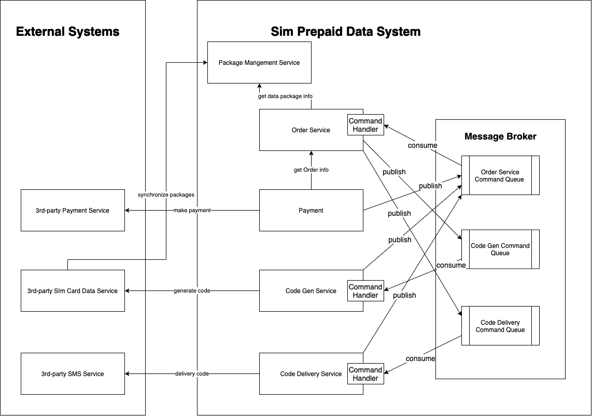

<br />
<p align="center">

<h3 align="center">Solution Details</h3>


<!-- TABLE OF CONTENTS -->
<details open="open">
  <summary>Table of Contents</summary>
  <ol>
    <li><a href="#architecture">Requirements</a></li>
    <li><a href="#Solution">Solution</a></li>
    <li><a href="#limitations">Implementation Limitations</a></li>
    <li><a href="#technologies">Technologies</a></li>
  </ol>
</details>

<!-- Requirements -->

## Requirements

### Functional Requirements

1. User should be able to create/read/update/delete data packages (synchronize packages from 3rd-party provider service)
2. User should be able to make an order for a data package
3. User should be able to make payment for an order
3. Once user makes a payment successfully for an order, system will generate code, deliver code to user by sending a
   message to user' phone number

### Non-functional Requirements

Non-functional requirements are not specified in this project.

<!-- APPLICATION ARCHITECTURE -->

## Solution

### High level design

<p align="center">
    
</p>

### Services

Microservices decomposition: we apply orchestration-based Saga pattern to design microservices architecture

1. Order Service
2. Package Management Service
3. Payment Service
4. Code Gen Service
5. Code Delivery Service
6. Messaging Queue Servies

In this architecture, order service is orcherstator, it will make decision on what and where is next step to process
based on order status:

1. Order service create an order and then wait for a payment event from Payment service
2. User makes a payment with Payment service and then Payment service will notify Order service about successful payment
3. Once Order service received a payment message, it will process to next steps as logic implemented in Order service -
   please check ``OrderChannelHandler.java`` for details.

### Order Processing Flow

<p align="center">
    
</p>

### Database

Database Schema is generated by Sping Data JPA. In this implementation there is only one table in each service. Please
check model class in source code to see the table structures, an example of model class: ```DataPackage.java```

<!-- TECHNOLOGIES -->

## Technologies

1. Backend: Java 8, Spring Boot - including Spring Data JPA, Hibernate
2. Database: embedded Derby
3. Message Broker: embedded ActiveMQ


